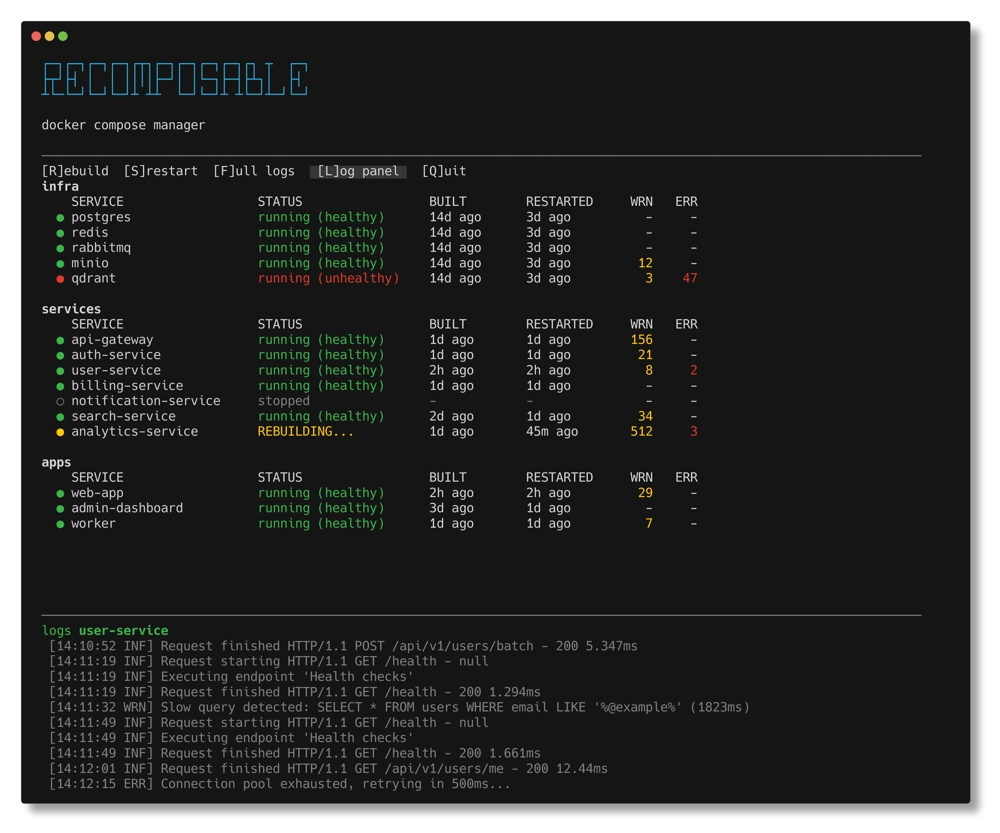

# recomposable

A lightweight Docker Compose TUI manager with vim keybindings. Monitor service status, restart or rebuild containers, and tail logs — all from your terminal.

Eliminate switching between countless terminal tabs or windows to rebuild you docker compose containers.

Zero dependencies. Pure Node.js.



## Install

```bash
npm install -g recomposable
```

This registers the `recomposable` command on your system.

## Quick Start

1. Navigate to your project directory (where your `docker-compose.yml` lives)
2. Create a `recomposable.json` config file
3. Run `recomposable`

```bash
cd ~/my-project
cat > recomposable.json << 'EOF'
{
  "composeFiles": [
    "docker-compose.yml"
  ]
}
EOF
recomposable
```

## Features

- **Multi-file support** — manage services across multiple compose files, grouped by file
- **Live status** — polls container state, health, build and restart times
- **CPU/Memory monitoring** — live CPU% and memory usage per container, with configurable color thresholds
- **Port mappings** — shows published ports for each service
- **Log pattern scanning** — counts WRN/ERR (configurable) occurrences across all services
- **Inline log panel** — tail logs for the selected service without leaving the list view, with search (`/`)
- **Full log view** — scrollable full-screen log viewer with live auto-scroll and search (`/`, `n`/`N`)
- **Start / Stop / Restart / Rebuild** — full container lifecycle management per service
- **No cache mode** — toggle to force a full clean rebuild (`--no-cache` + `--force-recreate`), off by default
- **Vim keybindings** — navigate with `j`/`k`, `G`/`gg`, and more

## Full Log View


## Adding Compose Files

Create a `recomposable.json` file in your project root:

```json
{
  "composeFiles": [
    "docker-compose.yml"
  ]
}
```

### Multiple compose files

```json
{
  "composeFiles": [
    "docker-compose.yml",
    "docker-compose.override.yml",
    "infra/docker-compose.monitoring.yml"
  ]
}
```

### CLI override

You can skip `recomposable.json` entirely and pass compose files directly:

```bash
recomposable -f docker-compose.yml
recomposable -f docker-compose.yml -f docker-compose.prod.yml
```

## Configuration

| Option | Default | Description |
|---|---|---|
| `composeFiles` | `[]` | Array of docker-compose file paths (relative to `recomposable.json`) |
| `pollInterval` | `3000` | Status polling interval in milliseconds |
| `logTailLines` | `100` | Number of log lines to show when entering full log view |
| `logScanPatterns` | `["WRN]", "ERR]"]` | Patterns to count in container logs |
| `logScanLines` | `1000` | Number of log lines to scan for pattern counts |
| `logScanInterval` | `10000` | Pattern scanning interval in milliseconds |
| `bottomLogCount` | `10` | Number of log lines shown in the inline log panel |
| `statsInterval` | `5000` | CPU/memory polling interval in milliseconds |
| `statsBufferSize` | `6` | Number of samples for rolling average (e.g. 6 x 5s = 30s window) |
| `cpuWarnThreshold` | `50` | CPU % above which the column turns yellow |
| `cpuDangerThreshold` | `100` | CPU % above which the column turns red |
| `memWarnThreshold` | `512` | Memory in MB above which the column turns yellow |
| `memDangerThreshold` | `1024` | Memory in MB above which the column turns red |

## Keybindings

### List view

| Key | Action |
|---|---|
| `j` / `Down` | Move cursor down |
| `k` / `Up` | Move cursor up |
| `s` | Start (if stopped) or restart (if running) |
| `p` | Stop selected service |
| `b` | Rebuild selected service (`up -d --build`) |
| `n` | Toggle no-cache mode (rebuild with `--no-cache` + `--force-recreate`) |
| `f` / `Enter` | Full-screen log view for selected service |
| `l` | Toggle inline log panel |
| `/` | Search in inline log panel |
| `G` | Jump to bottom |
| `gg` | Jump to top |
| `q` | Quit |

### Full log view

| Key | Action |
|---|---|
| `j` / `Down` | Scroll down |
| `k` / `Up` | Scroll up |
| `Ctrl+D` | Page down |
| `Ctrl+U` | Page up |
| `G` | Jump to bottom (live mode) |
| `gg` | Jump to top |
| `/` | Search logs |
| `n` | Next search match |
| `N` | Previous search match |
| `Esc` / `f` | Exit log view |
| `q` | Quit |

## Status Icons

| Icon | Meaning |
|---|---|
| Green circle | Running (healthy) |
| Red circle | Running (unhealthy) |
| Yellow circle | Rebuilding / Restarting / Starting / Stopping |
| Gray circle | Stopped |

## Todo

- Log search should search all container logs, not only the lines currently tailed by the tool

## Requirements

- Node.js >= 16
- Docker with `docker compose` (v2) CLI

## License

MIT
